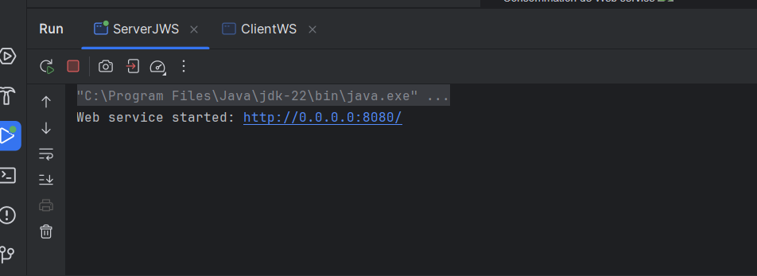
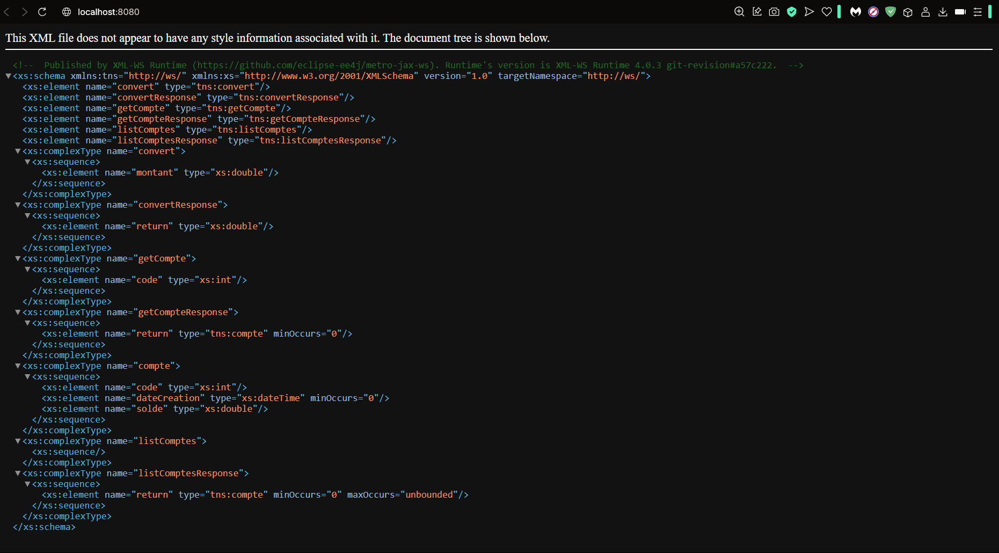
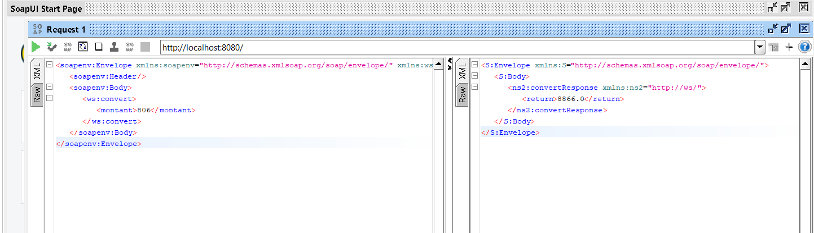
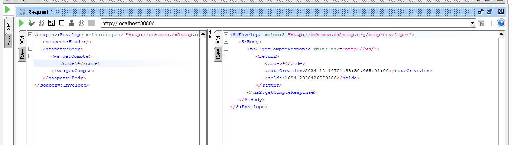
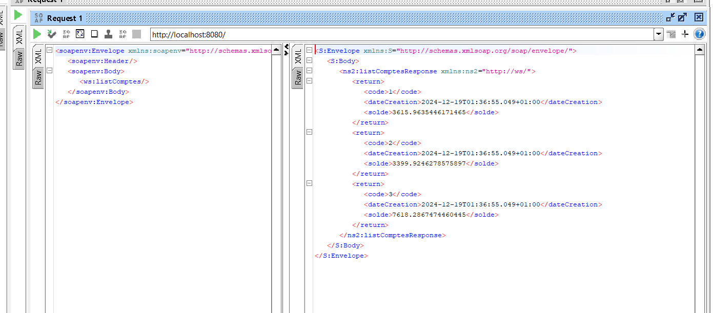
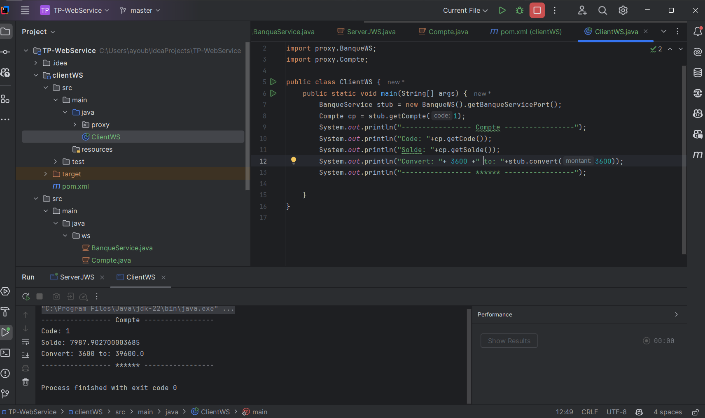

# Projet de Web Service SOAP 🛠️

## Application

Ce projet illustre la mise en œuvre et l’exécution d’un **web service SOAP**.

1. Créer un Web service qui permet de :
   - Convertir un montant de l’euro en DH
   - Consulter un Compte
   - Consulter une Liste de comptes
2. Déployer le Web service avec un simple Serveur JaxWS
3. Consulter et analyser le WSDL avec un navigateur HTTP
4. Tester les opérations du web service avec l'outil SoapUI
5. Créer un Client SOAP Java

---

## Captures d’écran 🖼️

### 1️⃣ Port

### 2️⃣ WSDL

### 3️⃣ Convertir Euro en MAD

### 4️⃣ Afficher un Compte

### 5️⃣ Afficher les Listes de Comptes

### 6️⃣ Consommation de Web Service

---

## Ressources supplémentaires 📚

Pour en savoir plus sur les web services SOAP, consultez les ressources suivantes :

- [Documentation officielle de SOAP](https://www.w3.org/TR/soap/)
- [Tutoriel JAX-WS](https://www.baeldung.com/jax-ws)
- [Utilisation de SoapUI](https://www.soapui.org/)

---

## Auteur ✍️

Ce projet a été réalisé par [Ayoub el hallaoui](https://github.com/ayoub1elh).
